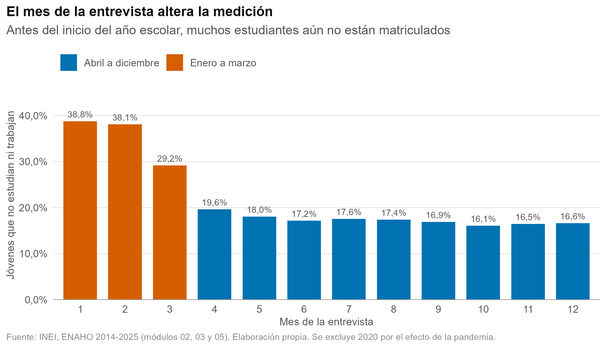
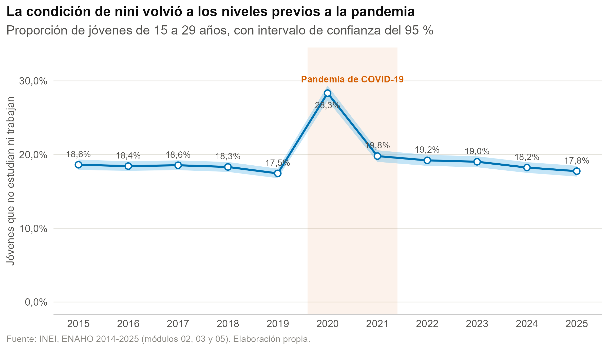
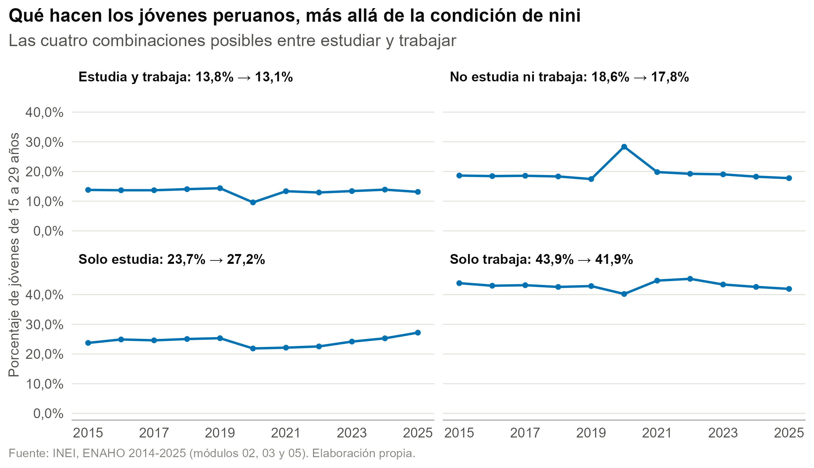
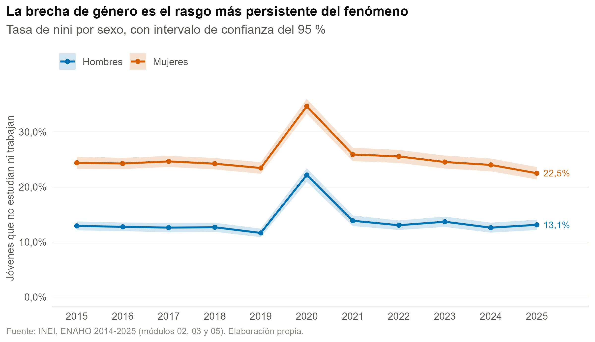
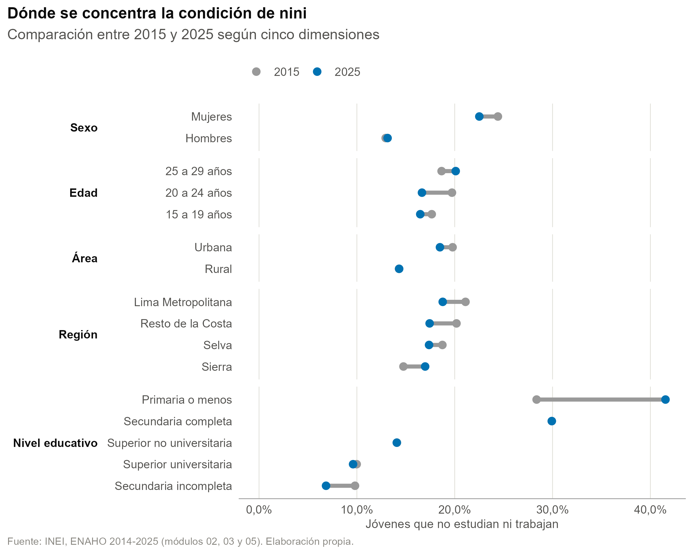
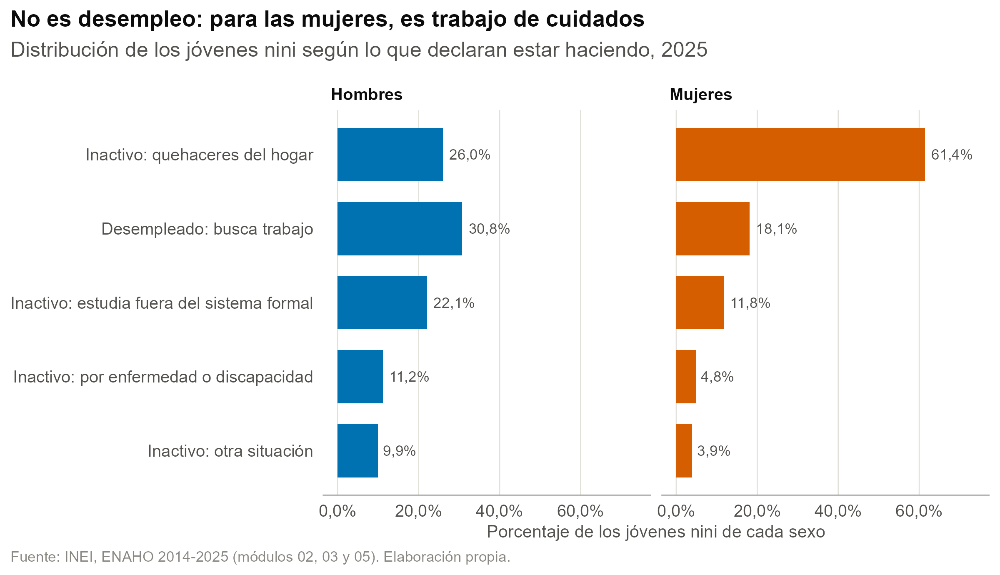
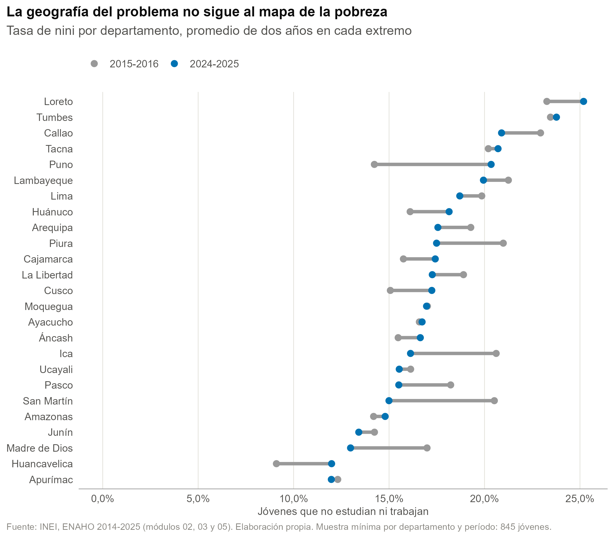

```{r}
#| label: setup

library(dplyr)
library(tidyr)
library(readr)
library(gt)

# Las cifras de esta exposición NO se recalculan: se leen de los mismos archivos
# que el reporte exporta al renderizarse (bloque `exportes` de reporte_ninis.qmd).
# Así es imposible que una diapositiva muestre un número distinto al del documento.
tabla <- function(archivo) read_csv(file.path("outputs/tables", archivo),
                                    show_col_types = FALSE)

serie     <- tabla("06_serie_nacional.csv")
pruebas   <- tabla("07_pruebas.csv")
grupos    <- tabla("08_tasas_por_grupo.csv")
educ_edad <- tabla("09_educacion_edad.csv")
situacion <- tabla("10_situacion_nini.csv")
robustez  <- tabla("11_robustez.csv")
dep       <- tabla("12_tasas_por_departamento.csv")
flujo     <- tabla("05_flujo_de_casos.csv")

# Formato de números, idéntico al del reporte: coma decimal y espacio para miles
f1 <- function(x) format(round(x, 1), nsmall = 1, decimal.mark = ",", big.mark = " ")
f0 <- function(x) format(round(x), big.mark = " ", scientific = FALSE)
f2 <- function(x) format(round(x, 2), nsmall = 2, decimal.mark = ",")
f_mill <- function(miles) f2(miles / 1000)
fp <- function(p) {
  if (p < 0.001) "< ,001"
  else sub("^0", "", format(round(p, 3), nsmall = 3, decimal.mark = ","))
}

# Accesos por año y por comparación, para no depender del orden de las filas
v <- function(anio, col = "tasa") serie[[col]][serie$anio == anio]
dif <- function(comp, col = "Diferencia") pruebas[[col]][pruebas$Comparación == comp]
tg <- function(dim, cat, col = "a2025") {
  grupos[[col]][grupos$dimension == dim & grupos$categoria == cat]
}
sit <- function(etiqueta, col = "Total") {
  situacion[[col]][situacion$situacion_nini == etiqueta]
}
ee <- function(nivel, edad) educ_edad[[edad]][educ_edad$nivel_educativo == nivel]

brecha_2025 <- tg("Sexo", "Mujeres") - tg("Sexo", "Hombres")
brecha_2015 <- tg("Sexo", "Mujeres", "a2015") - tg("Sexo", "Hombres", "a2015")

estilo_gt <- function(x) {
  x |>
    tab_options(
      table.font.size           = px(19),
      heading.align             = "left",
      column_labels.font.weight = "bold",
      row_group.font.weight     = "bold",
      source_notes.font.size    = px(13),
      data_row.padding          = px(3),
      table.width               = pct(100)
    ) |>
    opt_row_striping()
}
```

## La pregunta

> **¿Cómo evolucionó la proporción de jóvenes peruanos de 15 a 29 años que no estudian ni trabajan entre 2015 y 2025, y en qué grupos se concentra esta condición?**

::: {.lectura}
**Por qué importa.** La inactividad juvenil deja cicatrices medibles: en América Latina, un punto
porcentual más de ninis en una cohorte de 15 a 20 años se asocia con salarios **7,7 % más bajos entre
los varones y 3,0 % entre las mujeres** cuando esa cohorte llega a los 35 a 40 años
[@szekely2021youth]. En agregado, es capacidad productiva que el país no usa. Es el indicador
**8.6.1 de los ODS** [@onu2015agenda2030].
:::

::: {.nota}
El tramo de 15 a 29 años es el que define como *joven* la Ley N.º 27802 [@peru2002ley27802]. El
indicador de los ODS usa 15 a 24 años: lo reportamos como análisis de robustez. Ya en 2011,
@chacaltana2012empleo estimaban un 16 % de jóvenes en esta condición con la Encuesta Nacional de la
Juventud.
:::

## Nini no es lo mismo que desempleado

::: {.columns}
::: {.column width="54%"}
### Definición operativa

Persona de **15 a 29 años**, residente habitual del hogar, que cumple las dos condiciones a la vez:

1. **No estudia** — no matriculada en el año en curso, o matriculada pero sin asistir
   (`p306 ≠ 1` o `p307 ≠ 1`).
2. **No trabaja** — no ocupada según el indicador oficial de la PEA (`ocu500 ≠ 1`), definición del
   INEI que sigue a la OIT [-@oit1982ciet].
:::

::: {.column width="46%"}
### La distinción que cambia todo

El **desempleado** está en la PEA y busca trabajo activamente. El **nini** abarca a los desocupados
*y* a los inactivos.

En el Perú la distinción pesa más que en otros países: desde 2005 la participación y la PEA ocupada
se mueven en paralelo, porque el **sector informal absorbe a quienes entran** [@asencios2025hechos].
Quedarse fuera no se ve como desempleo, sino como inactividad.

::: {.lectura}
Esa diferencia es el eje de la interpretación, y lo adelantamos: solo
`r f1(sit("Desempleado: busca trabajo"))` % de los jóvenes nini está buscando trabajo.
:::
:::
:::

## Los datos: ENAHO 2014-2025

::: {.columns}
::: {.column width="56%"}
- **Fuente:** Encuesta Nacional de Hogares, INEI [-@inei2026enaho]. Muestra probabilística,
  estratificada y bietápica.
- **Unidad de análisis:** la persona residente habitual del hogar.
- **Cobertura:** nacional, urbana y rural, 24 departamentos y el Callao.
- **12 años × 3 módulos = 36 archivos** (`200` miembros, `300` educación, `500` empleo), 693 MB de
  archivos comprimidos.
- **Ponderación:** `fac500a`, el factor del módulo de empleo, con el **diseño muestral complejo**
  declarado en `srvyr` (conglomerado × año como unidad primaria).
:::

::: {.column width="44%"}
```{r}
#| label: tbl-flujo

flujo |>
  gt(rowname_col = "Paso") |>
  cols_label(Casos = "Casos", `% del paso anterior` = "% del anterior") |>
  fmt_number(columns = Casos, decimals = 0, sep_mark = " ") |>
  fmt_number(columns = `% del paso anterior`, decimals = 1, dec_mark = ",") |>
  sub_missing(missing_text = "—") |>
  tab_source_note("Acumulado de los doce años.") |>
  estilo_gt()
```

::: {.lectura}
`r f0(flujo$Casos[4])` jóvenes-año en la muestra analítica.
:::
:::
:::

## El dato no viene limpio {.denso}

::: {.columns}
::: {.column width="50%"}
### Tres trampas al leer los ZIP

1. **Tamaño.** El módulo de empleo de 2025 pesa 909 MB y tiene 1 413 columnas, porque el INEI pasó
   al formato Stata 118. Sin `col_select` al leer, **el proceso no corre**.
2. **Estructura inconsistente.** 2015 usa guion bajo en la carpeta interna y en el módulo 03 deja el
   `.dta` en la raíz. El patrón se ancla al **nombre del archivo**, no a la carpeta.
3. **Archivos que no buscamos.** Clasificadores, complementarios y un duplicado del módulo 500 en
   2015: un `*.dta` traería entre dos y cinco archivos por ZIP.
:::

::: {.column width="50%"}
### ¿Significan lo mismo en doce años?

No lo dimos por supuesto: auditamos las **etiquetas de Stata de los 36 archivos**.

::: {.lectura}
**Las tres variables que definen el indicador —`ocu500`, `p306` y `p307`— son idénticas en los doce
años**, así que la serie no necesita armonización.
:::

- `p313` y `p546` cambian de redacción, no de códigos.
- `p203` (2018), `p301a` (2017) y `t313a` (2020) suman códigos nuevos: las agrupaciones los absorben.
- Protección extra: **recodificamos por texto de etiqueta, no por número**. Si el INEI renumerara,
  el reporte falla de forma ruidosa en vez de asignar mal en silencio.
:::
:::

## La trampa de las vacaciones escolares

{.r-stretch fig-alt="Tasa de nini según el mes de entrevista: enero a marzo claramente más alta que el resto del año"}

::: {.lectura}
El año escolar peruano empieza en marzo: quien responde en enero dice con sinceridad que «este año»
todavía no está matriculado. **Lo corregimos reclasificando como estudiante a quien declara estar de
vacaciones** —categoría con el mismo código en los doce años— en lugar de descartar el primer
trimestre y perder un cuarto de la muestra.
:::

# Resultados {.seccion}

## La década terminó donde empezó

{.r-stretch fig-alt="Serie 2015-2025 con intervalo de confianza: mejora lenta, salto en 2020 y recuperación gradual"}

::: {.lectura}
Mejora lenta de `r f1(v(2015))` % (2015) a `r f1(v(2019))` % (2019); **ruptura en 2020**, con
`r f1(v(2020))` % —`r f1(v(2020) - v(2019))` puntos más, unos
`r f0(v(2020, "nini_miles") - v(2019, "nini_miles"))` mil jóvenes adicionales—; y cinco
años de recuperación hasta `r f1(v(2025))` % en 2025. Incluso en el mejor año de la serie,
**alrededor de uno de cada seis jóvenes**: cerca de `r f_mill(v(2025, "nini_miles"))` millones de
personas.
:::

## ...y el cambio de la década no es significativo

```{r}
#| label: tbl-pruebas

pruebas |>
  gt() |>
  fmt_number(columns = c(Diferencia, `IC inf.`, `IC sup.`), decimals = 2, dec_mark = ",") |>
  fmt_number(columns = p, decimals = 3, dec_mark = ",") |>
  text_replace(pattern = "^0,", replacement = ",", locations = cells_body(columns = p)) |>
  sub_small_vals(columns = p, threshold = 0.001, small_pattern = "< ,001") |>
  cols_label(p = md("*p*")) |>
  tab_style(style = cell_fill(color = "#faede3"),
            locations = cells_body(rows = Comparación == "2015 a 2025")) |>
  tab_source_note("Diferencia en puntos porcentuales, estimada con survey::svyglm sobre el diseño muestral complejo.") |>
  estilo_gt()
```

::: {.lectura}
El salto de 2019 a 2020 y la caída de 2020 a 2021 son, por lejos, los movimientos más grandes de la
serie. Pero la comparación que resume la década —**2015 contra 2025**— da apenas
`r f1(abs(dif("2015 a 2025")))` puntos de descenso y **no alcanza significancia estadística**
(*p* = `r fp(dif("2015 a 2025", "p"))`). Después de once años y de una pandemia, no podemos afirmar
que el país esté mejor que al inicio de la serie.
:::

## 2020 no fue «más ninis»: fue menos empleo

{.r-stretch fig-alt="Cuatro paneles con las combinaciones posibles entre estudiar y trabajar, 2015-2025"}

::: {.lectura}
«Solo trabaja» cae con fuerza y «estudia y trabaja» —la combinación más frágil, porque depende de
sostener las dos cosas— se reduce aún más; «solo estudia» sube, porque quienes combinaban ambas
actividades perdieron el empleo. **El aumento de los ninis es, en buena medida, el residuo de ese
colapso laboral.**
:::

## La brecha de género es el rasgo más persistente

{.r-stretch fig-alt="Tasa de nini por sexo entre 2015 y 2025: brecha estable que se ensancha en 2020"}

::: {.lectura}
En 2025 la tasa femenina es `r f1(tg("Sexo", "Mujeres"))` % y la masculina
`r f1(tg("Sexo", "Hombres"))` %: `r f1(brecha_2025)` puntos de brecha, frente a `r f1(brecha_2015)`
en 2015. Una década sin tendencia, y **la pandemia la ensanchó en lugar de cerrarla**. El descenso de
2025 es el mejor registro de la serie, pero es **un solo año**: habrá que mirar 2026.
:::

## ¿En qué grupos se concentra?

::: {.columns}
::: {.column width="60%"}
{fig-alt="Gráfico de pendiente con la tasa de nini de 2015 y 2025 en cinco dimensiones"}
:::

::: {.column width="40%"}
::: {.lectura}
**El sexo domina sobre cualquier otra dimensión:** la diferencia entre mujeres y hombres
(`r f1(brecha_2025)` p.p.) es mayor que la que separa a cualquier par de regiones o de áreas.
:::

- **25 a 29 años** es el único grupo de edad que empeoró
  (`r f1(tg("Edad", "25 a 29 años", "cambio"))` p.p.), mientras 20 a 24 mejoró con claridad.
- La **Sierra** es la única región que retrocedió
  (`r f1(tg("Región", "Sierra", "cambio"))` p.p.).

::: {.nota}
«Primaria o menos» sube con fuerza, pero es un grupo que se achica año a año conforme se expande la
cobertura educativa: lo que aumenta es su desventaja relativa, no necesariamente el riesgo de cada
persona.
:::
:::
:::

## El nivel educativo hay que leerlo por edad

```{r}
#| label: tbl-educ-edad

educ_edad |>
  gt() |>
  cols_label(nivel_educativo = "Nivel educativo alcanzado") |>
  fmt_number(columns = -nivel_educativo, decimals = 1, dec_mark = ",") |>
  tab_style(style = cell_fill(color = "#e3eff7"),
            locations = cells_body(columns = `25 a 29 años`)) |>
  tab_source_note("Tasa de nini (%) por nivel educativo alcanzado y grupo de edad, 2025. El nivel de quien aún estudia está en curso, no completo.") |>
  estilo_gt()
```

::: {.lectura}
«Secundaria incompleta» parece protectora —`r f1(ee("Secundaria incompleta", "15 a 19 años"))` % a
los 15-19 años— pero es un espejismo: esos jóvenes **siguen cursándola**. Dentro de los **25 a 29
años**, donde la trayectoria educativa ya terminó, aparece el gradiente limpio y monótono: de
`r f1(ee("Primaria o menos", "25 a 29 años"))` % con primaria o menos a
`r f1(ee("Superior universitaria", "25 a 29 años"))` % con universidad completa. **La educación
superior reduce a menos de un tercio la probabilidad de estar en esta condición.**
:::

## No es desempleo: es trabajo de cuidados

{.r-stretch fig-alt="Situación declarada de los jóvenes nini, por sexo, 2025"}

::: {.lectura}
Solo el `r f1(sit("Desempleado: busca trabajo"))` % de los jóvenes nini busca trabajo activamente; el
`r f1(sit("Inactivo: quehaceres del hogar"))` % se dedica a los **quehaceres del hogar**. Y ese
promedio esconde la asimetría: `r f1(sit("Inactivo: quehaceres del hogar", "Mujeres"))` % entre las
mujeres nini frente a `r f1(sit("Inactivo: quehaceres del hogar", "Hombres"))` % entre los hombres.
**La brecha de género no es principalmente un problema de demanda de empleo, sino de distribución del
trabajo de cuidados:** una política centrada solo en intermediación laboral difícilmente la mueva.
:::

## El territorio no sigue al mapa de la pobreza

::: {.columns}
::: {.column width="56%"}
{fig-alt="Tasa de nini por departamento, 2015-2016 frente a 2024-2025"}
:::

::: {.column width="44%"}
```{r}
#| label: extremos-dep

orden   <- dep |> arrange(desc(`2024-2025`))
top3    <- head(orden, 3)
bottom3 <- tail(orden, 3) |> arrange(`2024-2025`)
lista   <- function(x) paste(x, collapse = ", ")
```

**Tasas más altas (2024-2025):** `r lista(top3$departamento)`.

**Más bajas:** `r lista(bottom3$departamento)`, que incluyen dos de los departamentos más pobres del
país.

::: {.lectura}
La lectura tentadora —que la pobreza «protege»— es falsa. En las economías rurales de subsistencia
los jóvenes se incorporan temprano al trabajo agrícola o familiar, muchas veces sin remuneración, y
el indicador los cuenta como ocupados. **Una tasa baja no significa bienestar.**
:::

::: {.nota}
Con muestras departamentales de alrededor de mil jóvenes por período, estas cifras son señales, no
mediciones finas.
:::
:::
:::

## Robustez: la forma de la serie no cambia

```{r}
#| label: tbl-robustez

robustez |>
  filter(anio %in% c(2015, 2019, 2020, 2024, 2025)) |>
  gt() |>
  cols_label(anio = "Año") |>
  fmt_number(columns = -anio, decimals = 1, dec_mark = ",") |>
  tab_style(style = cell_fill(color = "#e3eff7"),
            locations = cells_body(columns = Principal)) |>
  tab_source_note("Tasa de nini (%) bajo seis criterios alternativos. En azul la definición usada en todo el reporte.") |>
  estilo_gt()
```

::: {.lectura}
El **nivel** se mueve según la definición; la **forma** no: todas las variantes muestran la misma
mejora hasta 2019, el mismo salto en 2020 y la misma recuperación. Sin corregir vacaciones la tasa
sube unos `r f1(mean(robustez[["Sin corregir vacaciones"]] - robustez$Principal))` puntos —la
magnitud del artefacto—; excluyendo la capacitación baja alrededor de
`r f1(mean(robustez$Principal - robustez[["Excluye capacitación"]]))` puntos, y esa es la variante
más cercana al indicador 8.6.1 de los ODS. **Las conclusiones no dependen de la definición elegida.**
:::

# Conclusiones {.seccion}

## Seis conclusiones

::: {.columns}
::: {.column width="50%"}
**1. La década terminó donde empezó.** De `r f1(v(2015))` % a `r f1(v(2025))` %:
`r f1(abs(dif("2015 a 2025")))` puntos porcentuales en once años, una diferencia que no alcanza
significancia estadística (*p* = `r fp(dif("2015 a 2025", "p"))`).

**2. La pandemia fue una ruptura, no una inflexión.** `r f1(v(2020))` % en 2020, y el análisis por
condición de actividad muestra que fue, sobre todo, **destrucción de empleo juvenil**.

**3. Ser mujer es, por lejos, el factor más asociado a esta condición.** La brecha quedó clavada toda
la década y la pandemia la ensanchó en lugar de cerrarla. Ninguna otra dimensión —edad, área,
región— se le acerca.
:::

::: {.column width="50%"}
**4. El problema no es desempleo: es trabajo de cuidados no remunerado.** Solo
`r f1(sit("Desempleado: busca trabajo"))` % busca trabajo, y
`r f1(sit("Inactivo: quehaceres del hogar", "Mujeres"))` % de las mujeres nini hace quehaceres del
hogar. **Es el hallazgo con implicancias más claras de política pública.**

**5. La educación superior protege, pero hay que medirlo bien.** Entre los 25 y 29 años, de
`r f1(ee("Primaria o menos", "25 a 29 años"))` % a
`r f1(ee("Superior universitaria", "25 a 29 años"))` %.

**6. La geografía no sigue al mapa de la pobreza.** No estar en condición de nini no equivale a estar
bien, y ese es el límite más serio del indicador.
:::
:::

## Qué se puede y qué no se puede concluir

::: {.columns}
::: {.column width="48%"}
### Alcance

Este análisis es **descriptivo**. Identifica cuántos jóvenes están en esta condición, cómo evolucionó
la cifra y en qué grupos se concentra.

**No** afirma causalidad: que las mujeres tengan tasas más altas no demuestra que el género *cause*
la condición. Tampoco habla de **trayectorias individuales**: comparamos cortes transversales
anuales, no seguimos a las mismas personas en el tiempo.

::: {.nota}
Circulan otras cifras: el @ipe2024jovenes estimó 1,2 millones de ninis para agosto de 2024, bastante
menos que la nuestra. La diferencia no se puede reconciliar porque esa publicación no documenta su
encuesta ni su período de referencia.
:::
:::

::: {.column width="52%"}
### Limitaciones principales

1. El INEI **imputa** parte de `p306`, `p307` y `ocu500` con la técnica *Hot Deck* [-@inei2025ficha].
2. La muestra tiene **componente panel**: los años no son muestras independientes.
3. **2020 mezcla dos efectos** —el real y el de la recolección telefónica— y no podemos separarlos.
4. La definición es **sensible al mes de entrevista**: es el supuesto más influyente del trabajo.
5. **No incorporamos pobreza ni ingresos** del hogar: falta el módulo Sumaria.
6. El indicador **no captura la calidad del empleo**.
:::
:::

## Qué haríamos con más tiempo

::: {.columns}
::: {.column width="52%"}
- Cruzar con **pobreza e ingresos** incorporando el módulo Sumaria.
- Explotar el **componente panel** de la ENAHO para medir cuánto tiempo permanecen los jóvenes en
  esta condición.
- Estimar un **modelo logístico multivariado** que separe el efecto de cada característica
  controlando por las demás.
- Incorporar la **presencia de hijos pequeños** en el hogar, que presumimos central para explicar la
  brecha de género.
:::

::: {.column width="48%"}
### Reproducibilidad

Todo el análisis vive en `docs/reporte_ninis.qmd`.

1. Abrir `Tarea_R_G7.Rproj`.
2. Ejecutar `scripts/01_descargar_enaho.R` si faltan los datos.
3. `quarto render docs/reporte_ninis.qmd`.

::: {.nota}
Las cifras de estas diapositivas se leen de `outputs/tables/`, que el reporte genera al renderizarse:
no hay números transcritos a mano. Las figuras usan la paleta de Okabe e Ito [-@okabe2008color],
distinguible bajo las formas más frecuentes de daltonismo.
:::
:::
:::

## Fuentes

::: {#refs}
:::

## Gracias {.seccion .center}

### Grupo 7 · Luis Guevara, Rodrigo Norabuena y Marco Virú

Preguntas.
